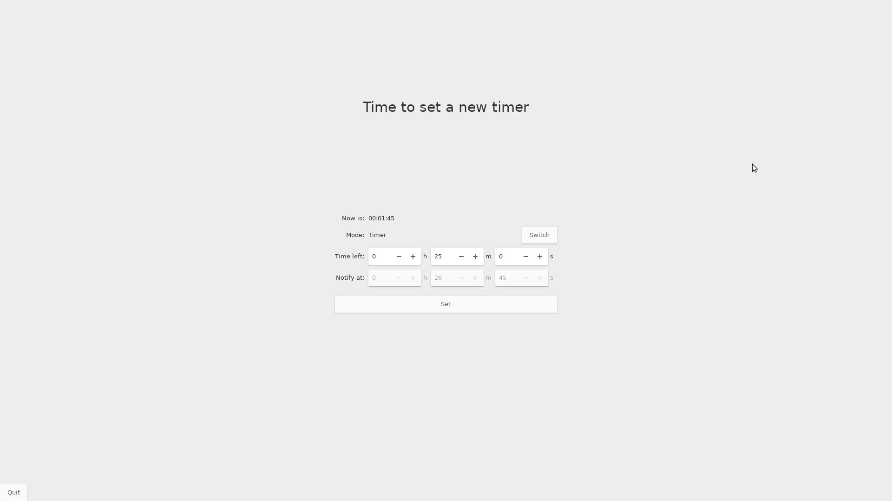

# ForceBreak - a reminder for taking break.

This is currently a personal project and I plan to use it daily.
Now I am both using it and testing it at the same time.
After testing phase, I will tried to add more features and deploy it.

The app is now look like this.

And also it come with an indicator and notifications.

## Why this app
There are actually some apps with the same idea as mine - 
to create a timer for works-breaks cycles. And it is well-known that 
they (and also I) are inspired by the pomodory technique. But if you look 
at the physical pomodoro timer, there are things that those apps could not do,
It is to set a new time after a work (and also rest) sessions.
I know that pomodoro technique requires working in a constant session time.
But there are cases when you want to work more/less, or rest more/less.
In those cases, the physical timer is actually more convinient than 
the existing apps. 

So my app is actually as simple as the physical one - when the alarm falls
off, it tell the user (actually, force the user by openning a 
fullscreen window) to set a new one. So:
- If you want to start/continue working, set a new timer.
- If you want take a rest, set a 5 minutes timer.
- If you want to work/rest more, continue set a new timer.
- If you want to ignore/snooze the timer, set a new timer.
- .... just set a timer.

As I mention above, there are works that require irregular working times.
But take a break is very important in productivity. I created this app
just to make sure I, myself, can look at the time and take the mini breaks.

## Installation and usage
I said that I am testing it. But now you can clone this git and run
    
    ./force_break/index.py

Of course, you need python3 and GObject introspection (which is already 
installed on must Linux distro), and yes this is a Gtk project.

After testing I will add another way to install it.
